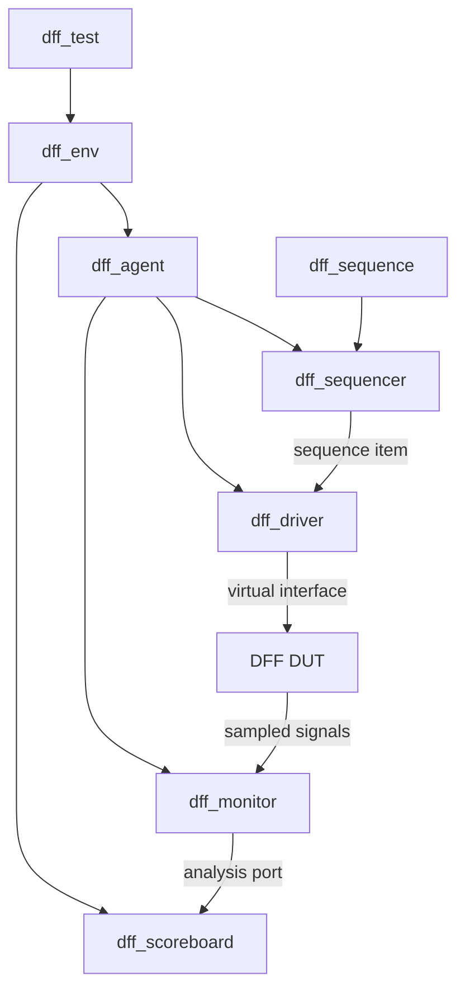
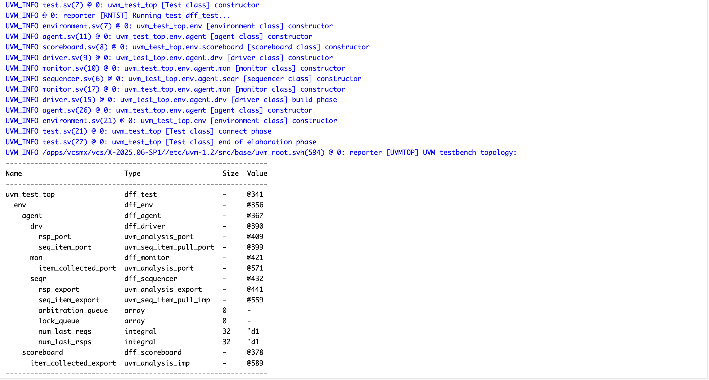
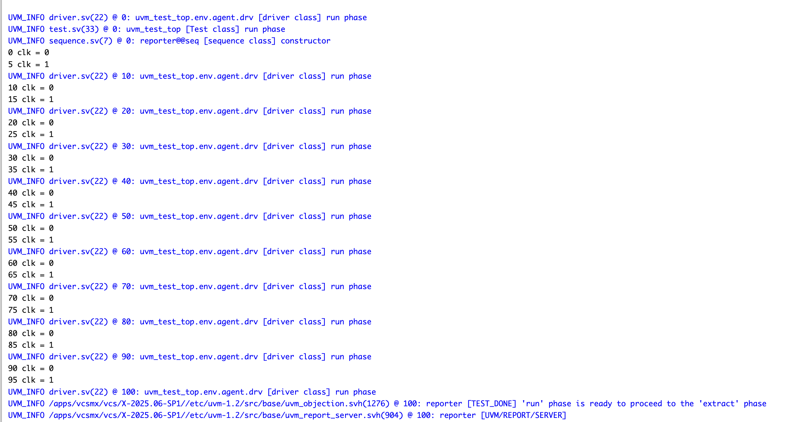
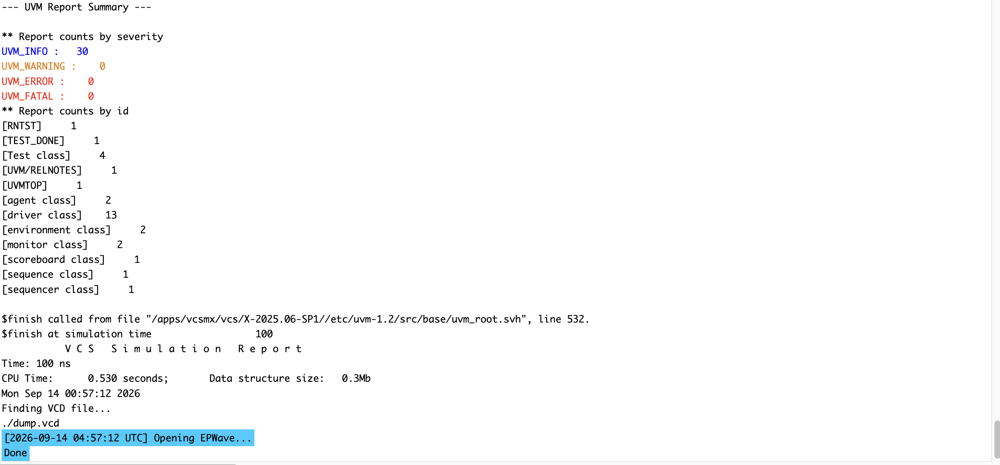
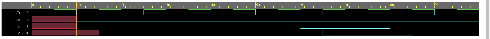

# D Flip-Flop Verification Using UVM

This project implements a complete introductory UVM testbench for a synchronous, active-high-reset D flip-flop. It demonstrates the standard UVM transaction flow from stimulus generation through DUT observation while keeping the design small enough to make the architecture easy to study.

## Verification scope

- Constrained-random `d` stimulus
- UVM sequence, sequencer, driver, monitor, agent, environment, test, and scoreboard structure
- Virtual-interface distribution with `uvm_config_db`
- Sequencer-to-driver transaction handshake
- Monitor-to-scoreboard analysis connection
- UVM factory registration and factory-based construction
- Phase objections and topology printing
- VCD waveform generation

The scoreboard in this learning version receives and stores monitor transactions but does **not** compare expected and actual values. Functional behavior is therefore demonstrated through waveform inspection, while the simulation report demonstrates clean UVM execution.

## Architecture



## DFF behavior

At each rising clock edge:

```systemverilog
if (rst)
  q <= 1'b0;
else
  q <= d;
```

The driver applies `d` and `rst` on the falling clock edge, giving the DUT stable inputs before the following rising edge.

## Project structure

```text
.
├── README.md
├── results/
│   ├── dff_waveform.png
│   ├── simulation_execution.png
│   ├── simulation_summary.png
│   └── uvm_topology.png
└── src/
    ├── design.sv
    ├── interface.sv
    ├── seq_item.sv
    ├── sequence.sv
    ├── sequencer.sv
    ├── driver.sv
    ├── monitor.sv
    ├── agent.sv
    ├── scoreboard.sv
    ├── environment.sv
    ├── test.sv
    └── testbench.sv
```

## Running the project

The project was run with Synopsys VCS and UVM 1.2 on EDA Playground.

1. Add `src/design.sv` as the design source.
2. Add the remaining files or use `src/testbench.sv`, which includes the UVM testbench classes.
3. Select SystemVerilog, Synopsys VCS, and UVM 1.2.
4. Enable waveform generation and run the simulation.
5. Open `dump.vcd` in EPWave to inspect `clk`, `rst`, `d`, and `q`.

## Results

### UVM topology

The topology confirms creation of the test, environment, active agent, sequencer, driver, monitor, and scoreboard.



### Simulation execution

Ten sequence items are processed and the run phase completes at 100 ns.



### UVM report summary

The recorded run completed with zero UVM warnings, errors, and fatals.



### Waveform-validated functionality

The waveform shows `q` capturing the applied `d` value on rising clock edges. Reset remains deasserted during this recorded run.



## Current limitations

- The scoreboard stores observed transactions but does not implement a reference-model comparison.
- The recorded stimulus run does not assert reset.
- Functional confirmation for this version is based on waveform inspection.

These limitations are stated explicitly so the repository accurately represents the implemented verification behavior.
