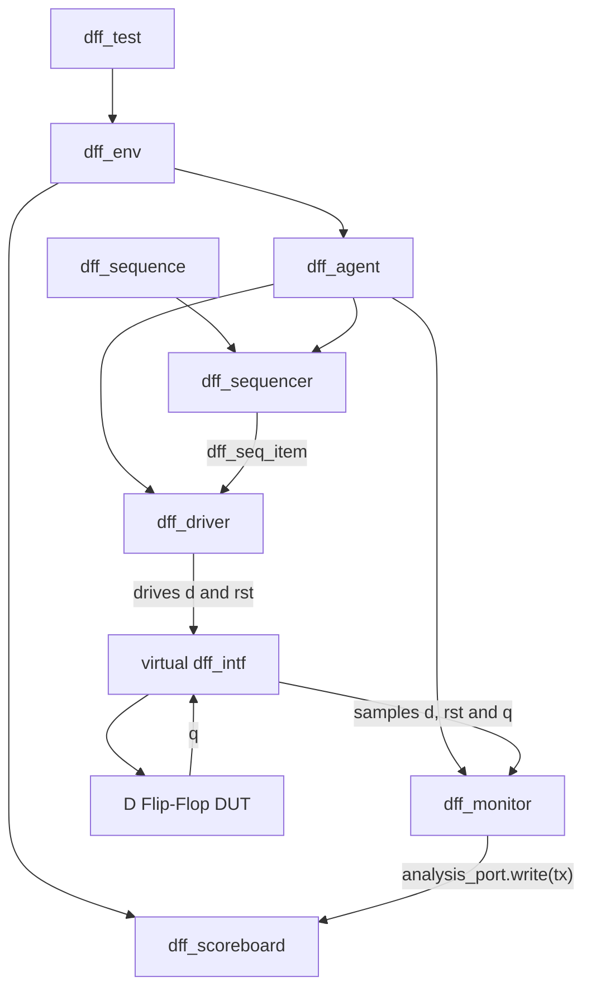

<div align="center">

# D Flip-Flop Verification Using UVM

### A complete introductory UVM environment for a synchronous D flip-flop


Constrained-random stimulus • Factory-based construction • TLM communication • Waveform validation

</div>

---

## Overview

This project verifies a positive-edge-triggered D flip-flop using a complete UVM testbench. Although the DUT is intentionally small, the environment demonstrates the same component structure and transaction flow used in larger verification projects.

| DUT input | DUT output | Reset | Validation |
|:---:|:---:|:---:|:---:|
| `d` | `q` | Synchronous, active high | Waveform inspection |

> **Verification scope:** The recorded run demonstrates clean UVM execution and waveform-validated DFF behavior. The scoreboard receives transactions but does not yet perform expected-versus-actual comparisons.

## DFF functionality

At every rising edge of `clk`, the output is cleared when reset is asserted; otherwise, it captures `d`.

```systemverilog
always_ff @(posedge clk) begin
  if (rst)
    q <= 1'b0;
  else
    q <= d;
end
```

```text
Rising clock edge
       │
       ├── rst = 1  ──►  q = 0
       │
       └── rst = 0  ──►  q = d
```

## UVM verification architecture



### Transaction flow

```text
Sequence → Sequencer → Driver → Interface → DUT
                                          │
Scoreboard ← Analysis Port ← Monitor ←─────┘
```

## Concepts demonstrated

- `uvm_sequence_item` transaction modeling
- Parameterized sequence, sequencer, and driver
- Sequence-item request handshake
- Virtual-interface sharing through `uvm_config_db`
- Factory registration and `type_id::create()`
- Driver operation on the falling edge for stable DUT inputs
- Continuous monitor sampling
- Analysis-port connection from monitor to scoreboard
- UVM build, connect, elaboration, and run phases
- Run-phase objection control
- Testbench topology printing
- VCD waveform generation

## Repository structure

```text
DFF-UVM-Verification/
├── README.md
├── results/
│   ├── dff_waveform.png
│   ├── simulation_execution.png
│   ├── simulation_summary.png
│   └── uvm_topology.png
└── src/
    ├── design.sv
    ├── interface.sv
    ├── seq_item.sv
    ├── sequence.sv
    ├── sequencer.sv
    ├── driver.sv
    ├── monitor.sv
    ├── agent.sv
    ├── scoreboard.sv
    ├── environment.sv
    ├── test.sv
    └── testbench.sv
```

## Simulation results

### Waveform-validated behavior

The waveform shows `d` being driven before the rising edge and `q` capturing that value on the active clock edge. Reset remains deasserted in this recorded run.


### UVM topology

The generated topology confirms the complete hierarchy: test, environment, active agent, driver, sequencer, monitor, and scoreboard.


### Execution and report summary

| Simulation execution | UVM report summary |
|---|---|
|  |  |

The recorded simulation processed ten sequence items, ended normally at **100 ns**, and reported:

| Severity | Count |
|:---|---:|
| `UVM_WARNING` | **0** |
| `UVM_ERROR` | **0** |
| `UVM_FATAL` | **0** |

## Running on EDA Playground

1. Select **SystemVerilog** as the language.
2. Select **Synopsys VCS** with **UVM 1.2**.
3. Add `src/design.sv` as the design source.
4. Add the remaining files; `src/testbench.sv` includes the UVM class files.
5. Enable waveform generation and run the simulation.
6. Open `dump.vcd` in EPWave and display `clk`, `rst`, `d`, and `q`.

## Current limitations and next steps

| Current implementation | Planned improvement |
|---|---|
| Scoreboard stores monitored transactions | Add cycle-accurate expected/actual comparison |
| Recorded run keeps reset deasserted | Add dedicated reset sequences and tests |
| Functional behavior checked visually | Add assertions and automated pass/fail reporting |

---

<div align="center">

**Built as a hands-on introduction to reusable UVM verification architecture.**

</div>
